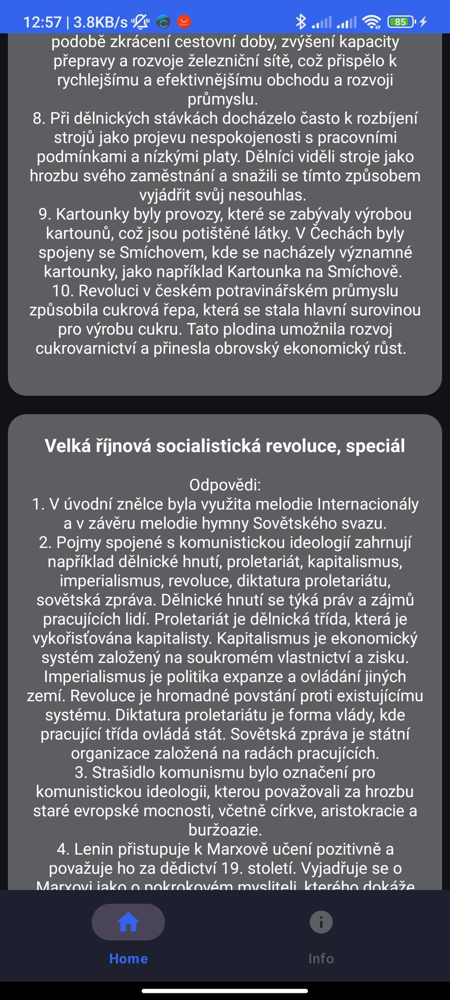
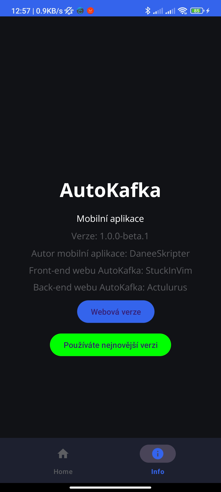
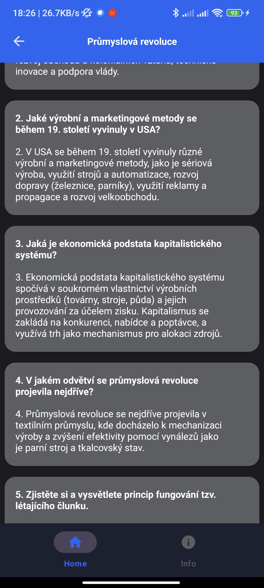

# AutoKafka - Mobilní aplikace
## 📜 O aplikaci
- Mobilní aplikace pro webovou stránku systému [AutoKafka](https://cernyrob.in/kafka)
- Co aplikace zatím umí si můžeš přečíst [zde](./README.md#průběh-vývoje)
## 🖼 Screenshoty

  
  
  

## Stažení aplikace [BETA Verze]
- Aplikaci lze stáhnout zde na GitHubu
- [Klikni pro stažení](https://github.com/DaneeSkripter/AutoKafkaApp/releases)
## Průběh vývoje
| Funkce   | Stav      | Verze 
| -------- | --------- | ----- |
| Vytvoření základu aplikace (navbar) | ✅ | - |
| Vyplnit informace do info tabu | ✅ | - |
| Nastavit custom check for updates službu | ✅ | - |
| Odesílaní API requestů a následný příjem informací z AutoKafka API | ✅ | v1.0.0-beta.1 |
| Vytvoření front-endu aplikace (Otázky a odpovědi z videí) | ✅ | v1.0.0-beta.2 |
| Možnost odesílat žádosti o přidání videa | ❌ |
